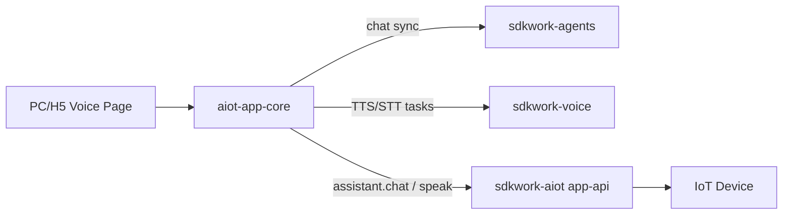

# Agents and Voice Dialogue Integration

SDKWork AIoT console surfaces (PC and H5) integrate sibling applications **sdkwork-agents** and **sdkwork-voice** for cloud-based intelligent dialogue, without replacing device-side speech when hardware is online.

## Architecture



## Dependency Wiring

| Layer | Package | Role |
| --- | --- | --- |
| Workspace | `pnpm-workspace.yaml` | Links `@sdkwork/agents-app-sdk`, `@sdkwork/voice-app-sdk` from sibling repos |
| Shared core | `@sdkwork/aiot-app-core` | Orchestration: `createAiotVoiceDialogueService`, dialogue port factory |
| Host (PC/H5) | `*-core/ports/dialoguePorts.ts` | Thin SDK bridge → shared factory |
| Host (PC/H5) | `vite.config.ts` aliases | Dev-time resolution to sibling SDK TypeScript sources |

## Dialogue Flow

1. **User input** — text field or microphone.
2. **STT** — if `voiceDialoguePort.transcribe` is configured, record via `MediaRecorder` and call sdkwork-voice; otherwise browser `SpeechRecognition`.
3. **Agent reply** — if agents port is configured, create remote session + sync chat via sdkwork-agents; else fall back to device `assistant.chat` command with polling.
4. **TTS playback** — if selected device is **online**, prefer device `speak` command; else if voice port is configured, sdkwork-voice synthesize + poll + play audio URL; else browser `speechSynthesis`.

## Environment Keys

Set in `configs/topology/standalone.split-services.development.env` or app `.env.example`:

```env
VITE_SDKWORK_AGENTS_APP_API_BASE_URL=http://127.0.0.1:8095
VITE_SDKWORK_VOICE_APP_API_BASE_URL=http://127.0.0.1:18096
VITE_SDKWORK_AIOT_AGENTS_DEFAULT_AGENT_ID=agent.aiot.assistant
VITE_SDKWORK_AIOT_VOICE_DEFAULT_MODEL=tts-1
VITE_SDKWORK_AIOT_VOICE_DEFAULT_VOICE=alloy
VITE_SDKWORK_AIOT_VOICE_TRANSCRIPTION_MODEL=whisper-1
```

Start sibling services before testing dialogue:

- `sdkwork-agents` app-api on port 8095 (default)
- `sdkwork-voice` app-api on port 18096 (default)

## Mini-Program Scope

WeChat mini-program runtime does not support the same browser/SDK stack. The mini-program voice page sends device `speak` commands only. Cloud agents/voice integration is PC/H5 only.

## Device-Side Intelligence

For on-device speech (XiaoZhi protocol, kernel routing), see `docs/architecture/XIAOZHI_INTELLIGENCE_INTEGRATION.md`. Console agents/voice ports are independent of device-side assistant routing.
